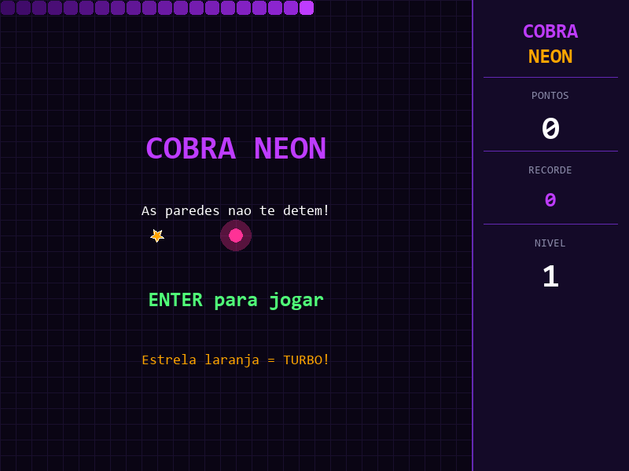

# Cobra Neon

Jogo da cobra com tema neon violeta — as paredes não te detêm! A cobra atravessa os limites da tela e ressurge do lado oposto. Colete a estrela laranja para ativar o modo TURBO e dobrar seus pontos.



## Funcionalidades

- **Wrap-around** — a cobra atravessa as paredes e reaparece do outro lado
- **Tema violeta neon** — fundo escuro com cobra gradiente roxo/violeta e olhos animados
- **Comida pulsante** — efeito de brilho e pulso na comida rosa
- **Power-up TURBO** — estrela laranja aparece a cada 5 itens coletados: +5 pontos e pontuação dobrada por 5 segundos
- **Progressão de velocidade** — velocidade aumenta conforme o nível sobe
- **Partículas** — explosão de partículas ao comer e ao morrer
- **Flash vermelho** — tela pisca em vermelho na morte
- **Pausa** — tecla P pausa o jogo
- **Recorde local** — salvo automaticamente em `highscore.json`
- **Painel lateral** — pontos, recorde, nível e contador de TURBO em tempo real

## Controles

| Tecla | Ação |
|-------|------|
| `↑ ↓ ← →` | Mover a cobra |
| `W A S D` | Mover a cobra (alternativo) |
| `Enter` | Iniciar / reiniciar |
| `P` | Pausar / retomar |
| `Esc` | Sair |

## Requisitos

- Python 3.8+
- Pygame 2.x

```bash
pip install pygame
```

## Como jogar

```bash
python jogo.py
```

## Estrutura

```
curso-pygame/
├── jogo.py          # Jogo principal
├── highscore.json   # Recorde salvo automaticamente
├── coin.wav         # Som ao coletar
├── Invincible.mp3   # Música de fundo
└── screenshot.png   # Tela inicial
```
